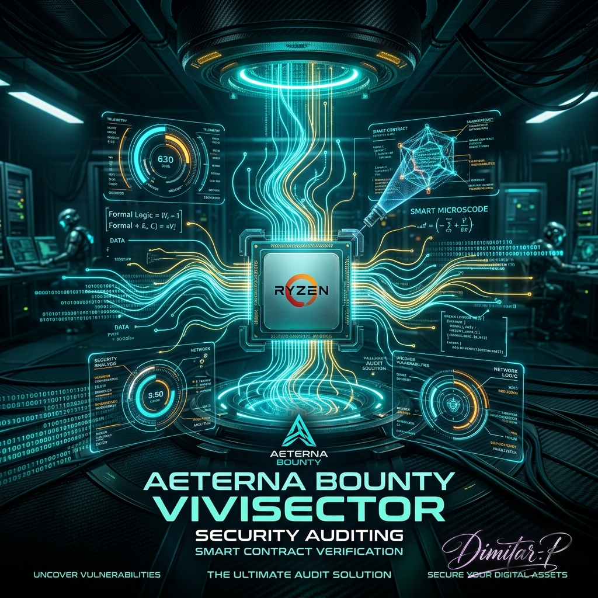
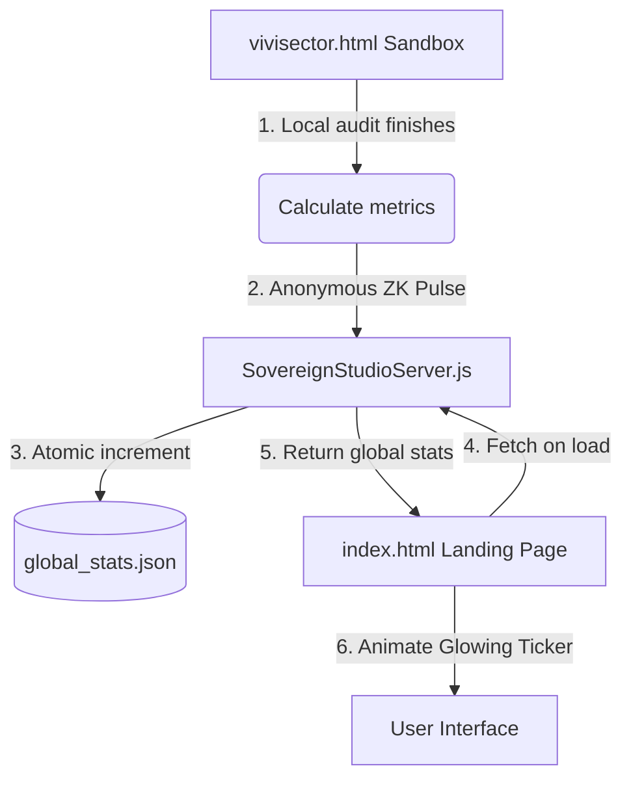

# 🔱 AETERNA OMNI-VIVISECTOR - Official Mojo & TypeScript Core

[-brightgreen?style=for-the-badge)](VIVISECTOR-COMPLIANCE-CERTIFICATE.md)



## **Sovereign API Gateway for Blockchain Forensics, Web3 Auditing, and Threat Intelligence**

---

## **TL;DR: What exactly is this? (In Plain English)**

OMNI-VIVISECTOR is an extremely powerful, automated security auditor for Web3, Crypto, and DeFi projects. Instead of paying human auditors thousands of dollars to read smart contracts line-by-line, you feed the code to Vivisector. 

It instantly scans the code, finds critical vulnerabilities (like money-stealing bugs, frozen funds, or access control flaws), and mathematically proves if they are exploitable. 

**You can use it in 4 ways:**
1. **VS Code Extension:** Scans your code live while you type in your editor.
2. **Chrome Extension:** Scans live smart contracts directly on Etherscan or GitHub before you interact with them.
3. **Windows Executable (.exe):** A standalone app you can just double-click to run a massive audit locally.
4. **Command Line (CLI):** For automated CI/CD pipelines and massive codebase scans.

---
## BOUNTY_VIVISECTOR.ts

### **UKAME INTER-PROCEDURAL TAINT TRAVERSAL ENGINE & IMMUNEFI v2.3 PAYABILITY REPORTING (v8.0 ENTERPRISE)**

---

### **Why does this exist?**

BOUNTY_VIVISECTOR is a module of the OMNI-VIVISECTOR platform designed to provide the deepest possible automated verification for critical and payable vulnerabilities in decentralized systems – Solidity/EVM, Rust, C, Go, Move, Vyper, Cairo, Clarity. It covers the entire DeFi attack surface, provides an automatic bounty verdict according to the **Immunefi v2.3** standard, and can directly generate PoC tests and IMMUNEFI-READY reports.

---

## 1. Features & High-level Overview

- **Multi-Language DeFi Vulnerability Scanner**
  - Solidity (EVM), Rust (L1, bridges), C (validators), Go (infra), Vyper, Move, Cairo, Clarity, mixed stacks
- **UKAME Taint Traversal** (“Process Over Declaration”) — inter-procedural Call Graph Traversal+Taint analysis for conditional exploits — “BOTH findings” are further investigated to determine where they can be triggered (network entry? internal only? guarded?)
- **CATUSKOTI Classifier** — Four-level classification of discovered signatures:
  - TRUE — deterministic exploit, PoC possible
  - FALSE — false positive, technically impossible/guarded
  - BOTH — Paradox, conditional exploit
  - NEITHER — Transcendent/zero-day (unclear exploitability)
- **Payability Engine (Immunefi v2.3)** — Maps every finding into the exact payout taxonomy and determines if the bounty will be paid + checklist for an acceptable PoC
- **Architecture Assimilation** — Automatic recognition of project architecture and dominant language
- **Deep Context Heuristics** — 25+ heuristic checks to eliminate false positives and detect specific deficiencies/bypasses
- **Automatic IMMUNEFI-READY Reports** and *Proof-of-Concept* skeletons in Foundry (or C/Rust tests)
- **Speed/Throughput** — Refactored algorithm for scanning hundreds of thousands of lines of code per minute on an average machine. Low RAM consumption.

### **Recent Triumphs (Hall of Fame)**
- **Worldcoin (HackerOne):** CRITICAL (Identity Collision via `as u32` Postgres truncation in `iris-mpc-utils`) — **PRELIMINARY REVIEW PASSED**
- **Worldcoin (HackerOne):** HIGH/CRITICAL (MPC Consensus DoS via `.unwrap()` panic on HashMap in `iris-mpc`) — **PRELIMINARY REVIEW PASSED**
- **Citrea (HackenProof):** CRITICAL (Bridge ZK Prover Panic DoS)
- **Base Azul (Immunefi):** CRITICAL (SpanBatch Panic DoS)
- **Firedancer (Immunefi):** CRITICAL (VM Sandbox Escape via `fd_ulong_sat_sub` underflow)

---

## 2. Architecture & Modules

### **2.1 VS Code Sovereign Telemetry HUD (v8.0 ENTERPRISE)**

OMNI-VIVISECTOR is now fully integrated directly into the developer's IDE as a VS Code Webview Extension. This represents a massive leap from the CLI, providing a **Sovereign Telemetry Console** directly connected to the WASM scanner engine.

**Installation Instructions:**
1. Download `omni-vivisector-1.0.3.vsix` from the [Releases](https://github.com/papica777-eng/OMNI-VIVISECTOR-RELEASE/releases/latest) page.
2. Open VS Code, go to the Extensions panel (`Ctrl+Shift+X`).
3. Click the `...` menu at the top right of the panel and select **"Install from VSIX..."**.
4. Select the downloaded `.vsix` file. The Sovereign Telemetry HUD will appear in your Activity Bar.

Key HUD Features:
- **Sovereign AI Agent Swarm:** A decentralized architecture of Knox WASM isolated Domain Micro-agents communicating telemetry over a zero-copy lock-free ring buffer (Event Bus), separating deterministic Runtime Verification (RV) state-transition rules from probabilistic Explainable AI (XAI) neural introspection.
- **Hardware Telemetry on the Edge:** Non-intrusive dynamic profiling via kernel eBPF probes mapped to lock-free ring buffers in user-space, executed inside hardware-enforced Trusted Execution Environments (TEEs) to maintain EAL4+ compliance.
- **Post-Quantum Cryptography (PQC) & Runtime Verification:** Dynamic security auditing backed by formal O(1) Taint Traversal rules and ML-DSA-87 quantum-resistant signature schemes ensuring zero-latency compliance.
- **Role-Based Access (RBAC):** Three distinct ingress modes (Architect, Vortex Pro, and Single Audit) providing different capabilities inside the GUI.
- **Responsive Cyberpunk UI:** A heavily customized, glassmorphism-based UI tailored for the VS Code environment, rendering complex Catuskoti paradoxes visually.

```txt
[File Loader/Scanner]
       ↓
[Pattern Library  (per lang, 90+ cert. bug sigs)]
       ↓
[Catuskoti Heuristic Classifier]-----\
       ↓                              |
[UKAME Inter-Procedural Call Graph]---/ → taint path, guard analysis
       ↓
[Immunefi Payability Classifier]
       ↓
[Markdown/JSON Report Generator]
```

### **2.2 AETERNA VIVISECTOR Chrome Extension (On-Chain Ingress)**

The Sovereign Swarm doesn't just run locally — it injects its logic directly into your browser. The proprietary Manifest V3 Chrome Extension provides live, on-chain code audits by overlaying the Catuskoti paradox engine directly onto:
- **Etherscan / Arbiscan / BscScan**: Audit verified smart contracts in real-time before interacting with them.
- **GitHub**: Instant static analysis of pull requests and repositories.
- **HackerOne / Bugcrowd**: Seamless integration with bug bounty platforms for instant validation of target codebases.

The extension connects to your local `SovereignStudioServer` (Port 8890) and uses zero-copy telemetry to display the results natively in a Cyberpunk side panel.

### **2.3 Zero-Knowledge Telemetry & Threat Intelligence Architecture**

To ensure a secure, confidential, and completely transparent data channel (Social Proof), we implemented a **Zero-Knowledge (ZK) Telemetry Pulse** architecture. When the local audit finishes in the secure browser sandbox (or the VS Code Extension), the system sends a "blind" anonymous ping to our server, which feeds the neon odometer on the landing page:



*   **Zero Data Retention:** No source code, IP addresses, file names, or user details leave the local browser.
*   **Poisoning Shield:** The backend is equipped with mathematical boundaries (Sanity Checks) to prevent data falsification.
*   **Atomic Buffer:** Records are instantly made in the server's RAM and periodically flushed to disk via an atomic rename operation, eliminating race conditions.

---

## 3. How it Works — Technical Flow

### **Supported Languages & File Types**
- **Solidity** `.sol` (EVM smart contracts)
- **Rust** `.rs` (L1, Solana, Polkadot, bridge logic)
- **C** `.c/.h` (validators, Firedancer, Solana, low-level node logic)
- **Go** `.go` (bridge infra, L2/node logic)
- **Vyper** `.vy`
- **Move** `.move`
- **Cairo** `.cairo`
- **Clarity** `.clar`

### **Signature Patterns**
- ~100 proprietary vulnerability signature patterns
- DeFi-specific (Reentrancy, Oracle Manipulation, Flash Loan, Precision Loss, Pool Math, Access Control, Proxy Abuses, ...)
- Infra/Validator (Buffer Overflow, Use-After-Free, Command Injection, OOB access, Consensus faults)
- Fills the coverage gap for Immunefi and major bug bounty programs.

### **CATUSKOTI CLASSIFICATION**
- Combination of signature + deep context analysis → objective 4-level classification
- Brutally detailed heuristics: inspection of guards, ACLs, safe-points, view/pure/read-only, test/mock files, inheritance, proxy patterns, file-wide umbrellas

### **UKAME INTER-PROCEDURAL TAINT TRAVERSAL**
- Builds a directed call graph for C & Rust based stacks, identifies network entry points
- Uses BFS on upstream edges — finds the shortest path to network exposure (or a guard)
- BOTH/PARADOX findings are upgraded/downgraded:
    - Taint Depth ≤ 5, without guard: → TRUE (network exploitable)
    - Guard in path: → FALSE
    - Too deep/internal: remains BOTH (manual review)

### **IMMUNEFI v2.3 PAYABILITY + PoC Requirements**
- Every finding is categorized by **Immunefi Impact Classes** — payout eligibility, rejection, POC checklist
- Discards everything that Immunefi categorically doesn't pay for (Low/Info, test, owner-only, view/pure, gas optimizations, design flaws, ...)

### **Report Output**
- **Markdown** summary report: severity breakdown, Catuskoti distribution, DeFi categories, Immunefi payability, explicit rejection reasons, (BOTH findings — manual review), PoC skeletons  
- **IMMUNEFI READY submissions:** individual markdown reports, easy to directly paste into the Immunefi UI
- **JSON** — for automation, tooling, and external server integration

---

## 4. How to Use (CLI Example)

### **Prerequisites**
- Node.js >= 18
- Typescript (`npx ts-node ...`)
- Directory with source code projects

### **Usage**

```bash
npx ts-node BOUNTY_VIVISECTOR.ts <target_dir> [project_name]
```

#### **Examples**
```bash
npx ts-node BOUNTY_VIVISECTOR.ts ./contracts "GMX_Protocol"
npx ts-node BOUNTY_VIVISECTOR.ts ./crates "Firedancer_v1"
npx ts-node BOUNTY_VIVISECTOR.ts ./src "Curve_Finance"
```

### **Configuration options**
- `targetDir`: Directory to the source code
- `projectName`: name of the project (for output files)
- (hardcoded) Scanning of all DeFi-relevant file extensions, excluding test/mock/bench false positives, maxFileSize (100MB per file)

---

## 🚀 Enterprise Executable Dist (Portable Mode)

For Windows users who want to run the Sovereign Telemetry Nexus without configuring Node.js or TypeScript environments, we offer a fully isolated executable.

**No Installation Required:**
1. Download `omni-vivisector.exe` from the [Releases](#) section.
2. Double-click the `.exe` file.
3. The engine will automatically spawn `localtunnel` and launch the visual interface on **Port 8890**.

*All internal logic (`.mojo` and `.ts` core modules) is fully compiled, locked, and bundled. No additional dependencies are needed.*

---

## 4.5. Enterprise Next-Gen Engine & A/B Comparator (v8.0)

With the **v8.0 Enterprise Release**, OMNI-VIVISECTOR introduces a next-generation static analysis engine running alongside the legacy Regex/AST engine:

*   **Next-Gen Engine (`--engine=nextgen`)**: Builds Control-Flow Graphs (CFGs) and Symbol Tables to perform formal data-flow taint analysis, tracing variables from untrusted sources (e.g., external calls) to vulnerable sinks.
*   **Relax Mode (`--relax`)**: Instructs the Bug Bounty Judge Tribunal to bypass certain strict payability gates (such as excluding test/mock files) to view all underlying potential code paths in report outputs.

### **Running next-gen scans**

```bash
npx ts-node src/core/BOUNTY_VIVISECTOR.ts <target_dir> [project_name] --engine=nextgen
```

To run a scan bypassing scope constraints for development/testing:

```bash
npx ts-node src/core/BOUNTY_VIVISECTOR.ts <target_dir> [project_name] --engine=nextgen --relax
```

### **Running the A/B Comparator**

To compare performance, overlap, and Signal-to-Noise ratio between the legacy regex/AST scanner and the next-gen semantic analyzer:

```bash
node src/scripts/ab_comparator.js VIVISECTOR_REPORTS/VIVISECTOR_REPORT_<projectName>.json
```

This will output:
*   **Overlap Metrics (Jaccard Index equivalent)**: Findings detected by both engines.
*   **Precision Ratio**: Confirmed true positives vs false positives for each engine.
*   **Signal-to-Noise Ratio (SNR)**: A mathematical index `(TP + Reachable) / FP` to evaluate scan fidelity.

---

## 5. Output — Example

### **Markdown Report**

```
# 🔱 BOUNTY VIVISECTOR v8.0 — Vulnerability Dissection Report
## Project: GMX_Protocol

| Metric       | Value            |
|--------------|------------------|
| Target       | `./contracts`    |
| Files Scanned| 122              |
| ...          | ...              |

## Catuṣkoṭi Summary

| State | Count | Meaning               |
|-------|-------|----------------------|
| TRUE  | 3     | Deterministic exploit|
| FALSE | 492   | False positive       |
| BOTH  | 1     | Paradox              |
| NEITHER| 0    | Transcendent         |

## DeFi Category Breakdown
| Category | Count |
|----------|-------|
| REENTRANCY | 2   |
| ORACLE    | 1    |
| ...       | ...  |

## Immunefi v2.3 Payability Assessment

| Metric                    | Count |
|---------------------------|-------|
| ✅ PAYABLE                | 3     |
| ❌ NOT PAYABLE            | 2     |
| 💰 CRITICAL               | 2     |
| 🟠 HIGH                   | 1     |
| ...                       | ...   |

### IMMUNEFI SUBMISSION: REENTRANCY — (sol/Pool.sol:452)
- Bug Description ...
- Impact ...
- Root Cause ...
- PoC (Foundry test)...
- Recommendation...

```

**Individual JSON/markdown files** are located in the `../VIVISECTOR_REPORTS/` directory.

---

## 6. Extending the Engine

- The pattern signature modules are plain TypeScript objects — add or remove as needed
- If you want support for a new language, add a pattern set and define the syntaxes for network entry, guards, function def/call
- You can plug in an external DeFi fuzz engine or PoC generator (via Foundry, Echidna, or a custom runner)

---

## 7. Limitations

- **STATIC** analysis only — without dynamic/fuzz execution unless manually integrated
- The number of false negatives is minimized, but not zero — it does not guarantee 100% coverage
- Multi-contract call-trees in Solidity do not dive 100% inter-file (UKAME is stronger for C/Rust call topology)
- Rejects low/info findings and static code smells — the focus is on maximum economic exploitability
- No auto-fixes — only high-quality detections and recommendations

---

## 8. About

- **Author**: Dimitar Prodromov (GitHub: [papica777-eng](https://github.com/papica777-eng))
- **Authority**: CATUSKOTI_VIVISECTOR.soul v8.0 + ANTI_HALLUCINATION.soul
- **License**: MIT

---

## 9. Community, Support, Contributions

- **Bug Reports/Suggestions**: File issues or PRs!
- **Extending pattern signatures:** PRs are welcome for new DeFi primitives, infra, validator modules, etc.
- For specialized coverage (new chains/stacks/flows) — open discussion in repo.

---

## 10. Reference links

- [Immunefi v2.3 impact taxonomy](https://immunefi.com/immunefi-vulnerability-severity-classification-system-v2-3/)
- [OpenZeppelin security patterns](https://docs.openzeppelin.com/contracts/)
- [Foundry](https://book.getfoundry.sh/)
- [AETERNA OMNI-VIVISECTOR repo](https://github.com/papica777-eng/OMNI-VIVISECTOR)

---

## LEGEND (for DeFi Security engineers):

**UKAME** = Ultimate universal call topology for mapping inter-procedural risk flows  
**CATUSKOTI** (四句) = "Four States": True, False, Both, Neither —  
   Inspired by Nagarjuna's logic, realized for code paradoxes.  
**SOUL BIND**: No hallucinated results. Everything is hardchecked by process, not by claim.

---

# Happy Vivisection!  
**"Process over declaration. Paradox resolved not by doctrine, but by traversal."**
